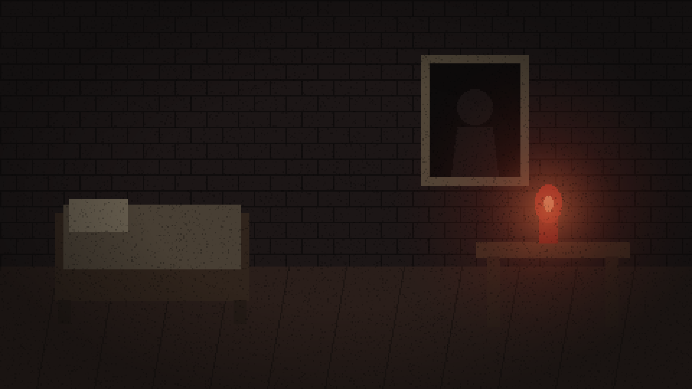

# Pieces of Mind

> *"Kalk. Yeniden."*

Hafızasını kaybetmiş bir şövalye, taş bir odada uyanır. Kafasının içinde bir ses vardır — ve o ses **sensin**.

**Pieces of Mind**, Ren'Py ile geliştirilen bir görsel roman / RPG / psikolojik korku oyunudur. Oyuncu, Yorgun Şövalye'nin kendisini değil, onun zihnindeki **Fısıltı'yı** — bir laneti — oynar. Şövalyeye fısıldarsın, emir veremezsin. Ve fısıldadığın her düşünceyi, şövalye kendi düşüncesi sanır.



## Özellikler

- **D20 zar sistemi** — Baldur's Gate 3 tarzı görsel zar paneli. Dört stat (KUVVET, ÇEVİKLİK, ZİHİN, ETKİ), zar + stat bonusu vs. zorluk derecesi. Doğal 20 kritik başarı, doğal 1 kritik başarısızlık — ve kritik başarısızlıklar affetmez.
- **Permadeath** — Ölüm kalıcıdır. Ölen koşunun kayıtları geçersizleşir; geri sarma ve kayıt yükleme ölümü geri almaz. Ama lanet ölmez: ölüm sayısı oyunlar arası taşınır ve anlatı bunu *hatırlar*.
- **Kalıcı bedeller** — Başarısız zarlar her zaman öldürmez; bazen bir statını, bazen alevinin bir parçasını alır. Işık küçülünce dünya da küçülür.
- **CRT/glitch estetiği** — GLSL shader'larla tarama çizgileri, vinyet, tüp titremesi; Fısıltı'nın müdahalelerinde gerçeklik bozulur.
- **Milk tarzı anlatım** — *Milk inside a bag of milk...*'ten ilhamla: kısa cümleler, kırmızı/krem/siyah palet, VT323 terminal fontu, daktilo akışı.

## İlham Kaynakları

| Oyun | Alınan |
|---|---|
| *Milk inside a bag of milk...* | Diyalog tarzı, minimal UI, meta-katman, psikolojik gerilim |
| *Baldur's Gate 3* | D20 zar sistemi, stat check'leri |
| *Dark Souls* | Karanlık dünya, kalıcı ölüm, kırıntı halinde anlatı |

## Oynamak / Geliştirmek

1. [Ren'Py SDK](https://www.renpy.org/latest.html) indir (8.5+).
2. Bu depoyu klonla: `git clone https://github.com/yavuzsss/pieces-of-mind.git`
3. Ren'Py Launcher'da proje dizini olarak depo klasörünü göster ve **Launch Project** de.

## Proje Yapısı

```
game/
├── script.rpy            # Karakterler + Sahne 1 (uyanış)
├── scene2_lamba.rpy      # Sahne 2 (lambaya yaklaşma)
├── scene3_koridor.rpy    # Sahne 3 (koridor, uçurum)
├── scene4_karsilasma.rpy # Sahne 4 (Sönmüş Şövalye)
├── stats.rpy             # Stat sistemi + D20 mekanizması
├── dice.rpy              # Görsel zar paneli
├── death.rpy             # Permadeath akışı
├── effects.rpy           # CRT/glitch shader'ları
├── ui.rpy                # Font, palet, textbox özelleştirmesi
├── images/               # Piksel art arka planlar
└── fonts/                # VT323 (OFL lisansı)
```

## Durum

Aktif geliştirme aşamasında — şu an 4 sahnelik bir dikey dilim oynanabilir durumda. Sırada: kule.

## Uyarı

Psikolojik korku öğeleri içerir. Ekran titremesi ve glitch efektlerine duyarlıysanız `persistent.crt_enabled` ile CRT katmanını kapatabilirsiniz.

---

*VT323 fontu [SIL Open Font License](https://openfontlicense.org/) ile lisanslanmıştır. Oyun Ren'Py ile geliştirilmektedir.*
