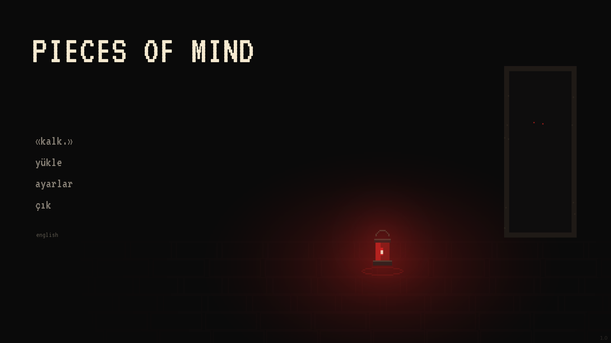
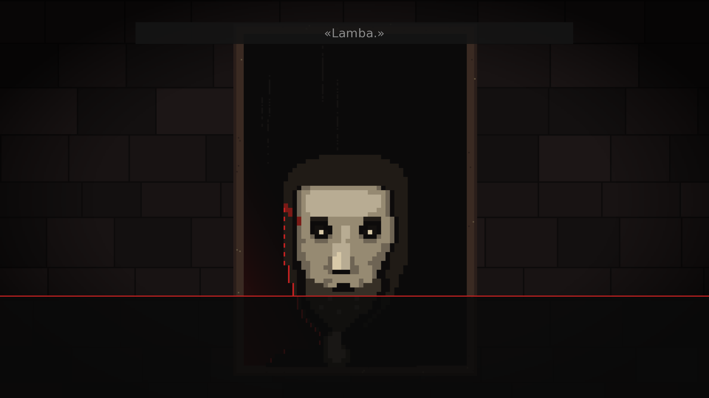
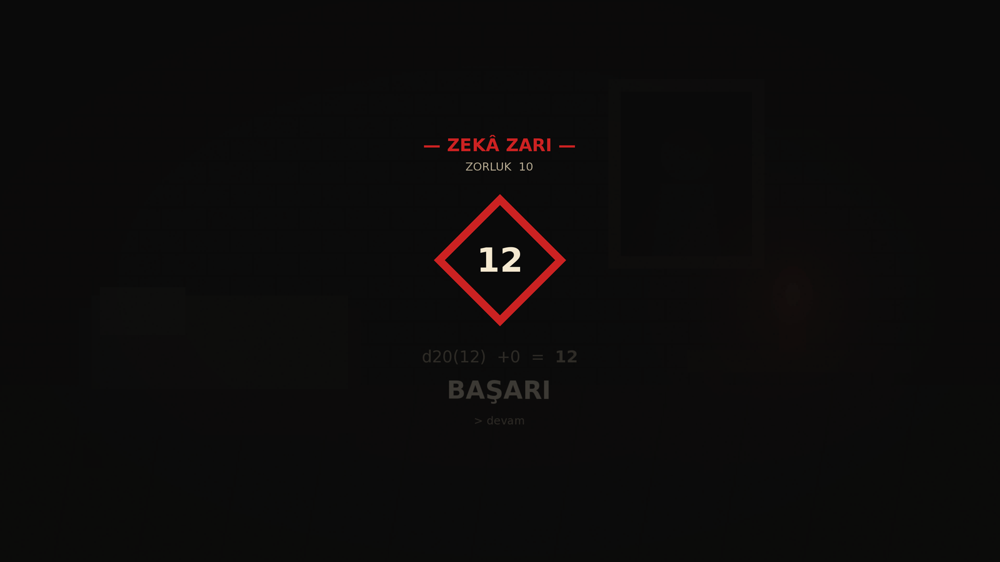
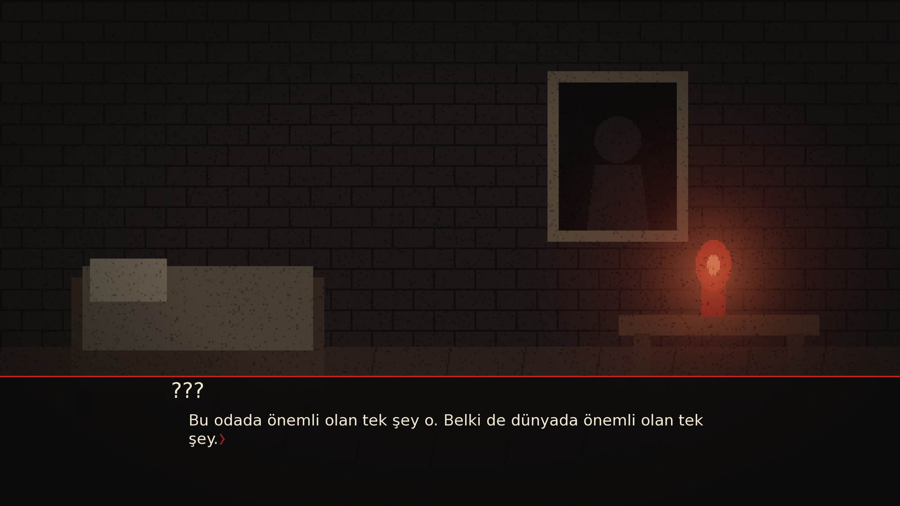

# Pieces of Mind

> *"Kalk. Yeniden."*

Hafızasını kaybetmiş bir şövalye, tanımadığı bir odada uyanır. Kafasının içinde bir ses vardır ve o ses **sensin**.

**Pieces of Mind**, Ren'Py ile geliştirilen bir görsel roman / RPG / psikolojik korku oyunudur. Oyuncu, Yorgun Şövalye'nin kendisini değil, onun zihnindeki **Fısıltı'yı** — bir laneti — oynar. Şövalyeye fısıldarsın, emir veremezsin. Ve fısıldadığın her düşünceyi, şövalye kendi düşüncesi sanır.



---

## Oyun Hakkında

Karanlık bir kulede geçen, dokuz sahnelik kapalı bir döngü. Şövalyenin adı çalınmıştır; kulenin tepesindeki **Koro** — isimlerden örülü altın bir alev — onu geri istemektedir. Oyuncu, şövalyenin zihnindeki sesin ta kendisi olduğu için hikâyenin tarafsız izleyicisi değildir: her fısıltı bir seçimdir, hiçbir seçim kurtarıcı değildir.

- **Dört farklı final** — hiçbiri "iyi son" değil, yalnızca biri sıcak.
- **Kalıcı ölüm (permadeath)** — ölüm koşuyu bitirir; kaydın geçersiz olur, ama Fısıltı yolu hatırlar.
- **Meta-anlatı** — oyuncunun kimliği hikâyenin çözümüdür; asla açıkça söylenmez, parça parça sezdirilir.
- **Türkçe ve İngilizce** — oyunun tamamı (≈1.400 diyalog bloğu) iki dilde.

## Ekran Görüntüleri

| Fısıltı kutuları | D20 zar sistemi |
|---|---|
|  |  |

| Şövalyenin odası | |
|---|---|
|  | Fısıltı'nın her repliği ekranın üstünde bir kutudur — tek seçenek olsa bile oyuncu ona tıklamak zorundadır. Söz, oyuncunun sözüdür. |

## Sistemler

| Sistem | Açıklama |
|---|---|
| **D20 zar** | GÜÇ / ZEKÂ / ŞANS + CAN. Baldur's Gate 3 tarzı görsel zar paneli: dönen zar, döküm, hüküm. Doğal 20 kritik başarı, doğal 1 kritik başarısızlık. |
| **Savaş** | Zorluk derecesinin üstündeki her puan düşmana hasar yazar; ıska CAN götürür. |
| **Yükselme** | Önemli olaylardan sonra oyuncu seçer: bir stat +1 ya da CAN +2. |
| **Gizli stres** | Göstergesi yok. Yalnızca etkisiyle hissedilir: CRT yoğunlaşır, metin bozulmaya başlar, seçenek kutuları titrer ve sırası karışır. |
| **Kalıcı ölüm** | Ölünce kayıt geçersizleşir; ölüm sayısı oyunlar arasında taşınır ve anlatı bunu bilir. |
| **CRT / glitch** | Shader tabanlı sürekli CRT katmanı + kritik anlarda glitch patlamaları. |

## Teknik

- **Motor:** Ren'Py 8.5 (Python 3)
- **Mimari:** Her sistem kendi modülünde — `stats.rpy` (zar/stat), `dice.rpy` (zar paneli), `stres.rpy` (gizli stres), `effects.rpy` (shader'lar), `death.rpy` (permadeath), `fisilti.rpy` (fısıltı kutuları), `upgrade.rpy`, `krediler.rpy`. `script.rpy` yalnızca ana akışı tutar.
- **Kayıt uyumluluğu:** Tüm oyuncu durumu `default` ile tanımlı (save/load + rollback uyumlu).
- **Arayüz:** `gui.rpy` / `screens.rpy` şablonlarına dokunulmadan, `ui.rpy` üzerinden yeniden tanımlama.
- **Yerelleştirme:** `game/tl/english/` — elle çevrilmiş tam İngilizce sürüm; kelime oyunları uyarlandı.
- **Görsel dil:** 480×270 piksel art, 4× NEAREST ölçekleme. Palet: kırmızı `#c22`, krem `#f5e9d0`, siyah `#0a0a0a`.

## Çalıştırma

```bash
# Ren'Py 8.5+ SDK gerekir
renpy.sh /path/to/pom2
```

Ya da Ren'Py Launcher'da projeyi açıp **Başlat**'a basın.

---

## In English

**Pieces of Mind** is a visual novel / RPG / psychological horror game built in Ren'Py. You do not play the amnesiac knight — you play the **Whisper** inside his head. You suggest; he decides, and he believes your thoughts are his own.

Features a D20 dice system with stat checks, permadeath, a hidden stress system that quietly corrupts the interface, four endings, and a full English translation. Language can be switched from the main menu.

---

## Lisans

Bu depo **kaynağı görünür**, açık kaynak değildir. Kod, senaryo, görsel ve ses
varlıklarının tümü telif hakkıyla korunmaktadır; okumaya izin verilir, kullanmaya
verilmez. Ayrıntılar için [LICENSE](LICENSE) dosyasına bakın.

© 2026 Yavuz Selim Şeremetli
